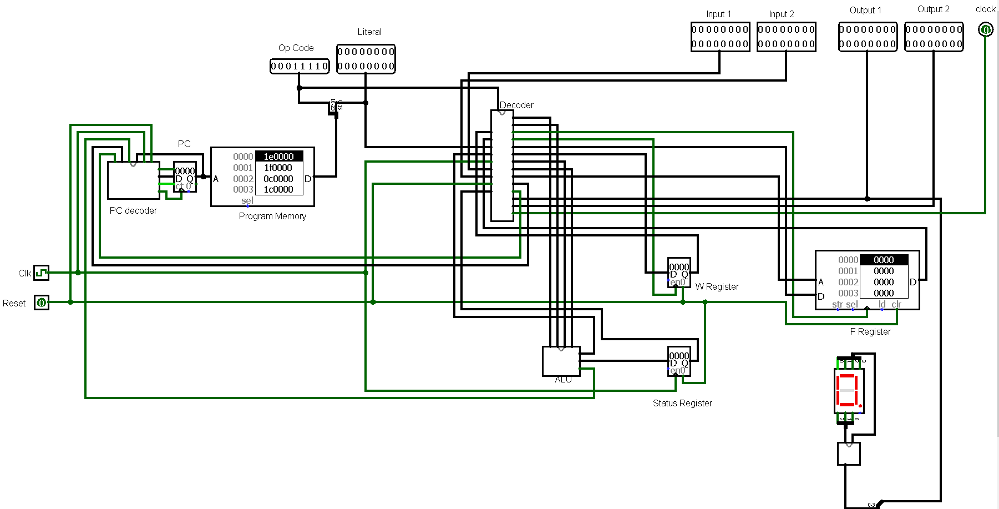

# 16 Bit Microcontroller

This project is for a simulation of a 16 Bit microcontroller made in [Logisim](http://www.cburch.com/logisim/). The repo also contains a compiler for the custom assembly language called GG asm that the microcontroller uses.  

 

For ref https://github.com/LogisimIt/Logisim